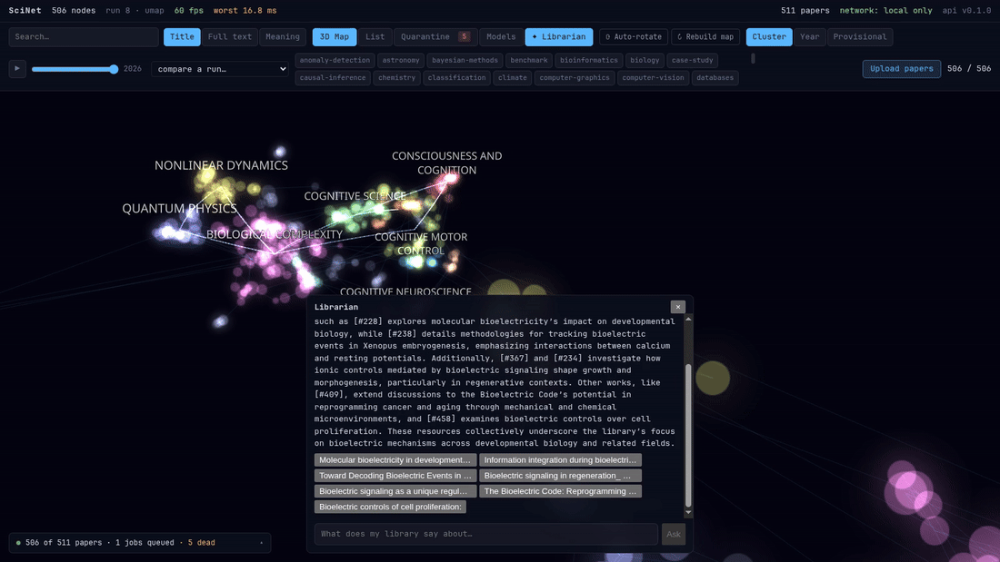
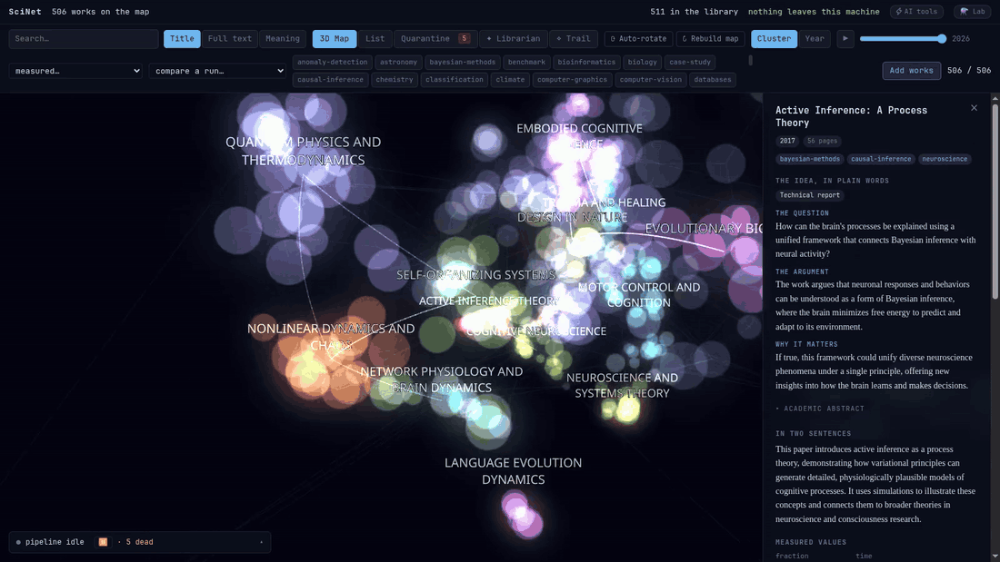
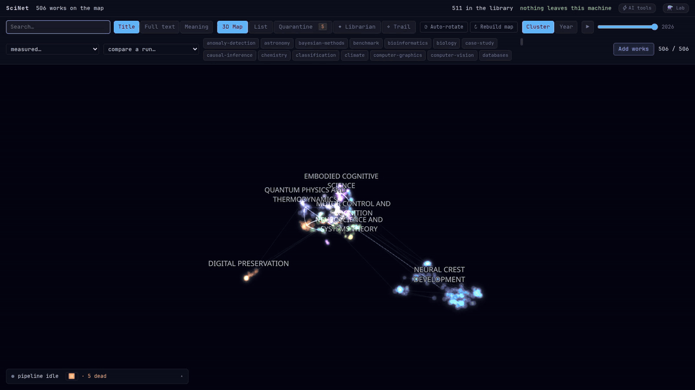

# SciNet

[](https://github.com/teo-clerk/SciNet/actions/workflows/ci.yml)
[](LICENSE)
[](backend/pyproject.toml)
[](#privacy)
[](#your-library-as-context-for-your-ai-tools)

> **A private 3D map of everything you've read.** Drop in a folder of PDFs and
> books; local models parse, embed, cluster and name your library. Nothing
> leaves your machine, the map never forgets its shape, and your AI tools can
> read it over MCP.


A library past a hundred documents stops being a list you can hold in your
head. Folders answer *where did I put it*; search answers *which one said X*;
neither answers *what do I actually have, where is it thin, and where should I
begin*. The tools that do answer those questions want your PDFs uploaded first.
SciNet answers them on your own machine, with models that fit one laptop.

## Who it is for

### You are starting a thesis, and the folder has 200 PDFs in it

A supervisor's shared drive, a directory called `to_read`, a literature review
due in six weeks. Copy the folder into `data/library/` and the map draws
itself: regions named in plain words, not keywords. Open a region and it says
**where to start** — the work nearest its centre, nudged toward anything that
calls itself an introduction, and away from the four-hundred-page book — and
lays a numbered **reading order** on the map:


Press play on the year scrubber and watch the field arrive:


And the library can be *asked*. The librarian is a local agent whose tool
calls are map actions: it plans its searches, streams an answer whose
citations are checked *while they stream* — a citation the retrieval never
saw is stripped mid-flight, visibly — and the camera flies to the evidence:



### You hunt parameters, not paragraphs

Forty papers on SAR interferometry, and the question is not *what is this
about* but *who reported below 5 mm at C-band*. Every number a paper states
next to a unit the extractor recognises becomes a row with the sentence it
came from — 18 kinds, SI-normalised — and the filter bar turns a range into
geometry. Extraction is allowlist-strict, because on a biology corpus a bare
"A" matched matrix indices a thousand times and amperes never; a token that
only *looks* like a unit goes to a local model, and its doubt lands in a
review queue. Nothing enters your filters on a guess.


**Full text** mode finds the exact phrase; the **List** view sorts what you
have by year, venue or title; the same queries are one tool call away from
your editor (below).

### You read across disciplines

Kant, Mill and a stack of cognitive-science preprints in one folder, and the
suspicion that they are talking about the same thing. Nothing to hand? The
welcome screen installs **History of Thought** — forty-one public-domain
openings from Plato to Darwin, shipped inside the repository, no network
involved. Every work gets **the idea, in plain words** before its abstract:
the question it takes up, the argument, why it matters, the claims and the
people it turns on — written for a reader from another field, with the
specialist's vocabulary kept alongside rather than replaced. EPUB, DOCX,
Markdown and plain text ingest beside the PDFs.



The **Trail** takes two ends — a paper each, or a phrase each — and finds the
chain of works that leads from one to the other through your own library,
each a small step from the last. When no chain exists it says so and shows
the jump, rather than hiding it.



### Your AI assistant should know what you have read

Claude Code or Cursor open all day, a 500-work library on disk, and no
intention of uploading it anywhere. One line connects them:

```bash
claude mcp add scinet -- uv --directory /path/to/SciNet/backend run scinet-mcp
```

Or press **⚡ AI tools** in the app, which shows that line with your path
already filled in, beside the equivalent for Claude Desktop, Cursor and Zed:


Then, from the assistant: *"What does my library cover?"* — *"Have I read
anything on active inference? Give me the three closest works and what each
argues."* — *"Which of my works is closest to 'On Liberty', and where do the
two disagree?"* Read-only, localhost-only, and the server tells the assistant
how to start the API if it is not running.

## Sixty seconds to a map

```bash
git clone https://github.com/teo-clerk/SciNet && cd SciNet && cp .env.example .env
cd backend && uv sync --group dev && uv run alembic upgrade head
cd ../frontend && bun install
cd ../backend && uv run scinet-up          # API + worker + UI, one terminal
```

Open <http://localhost:5173>. Drop files on it, copy them into
`data/library/`, or click **History of Thought**. Models (~11 GB) download on
first use, or ahead of time with `scripts/download_models.py`; the
[USAGE guide](USAGE.md) covers setup in full, Windows included.

Requirements: Python **3.12** (pinned — `umap-learn` is not tested above it),
bun, the [Ollama](https://ollama.com) binary (SciNet runs its own instance),
and an NVIDIA GPU with 8 GB for the comfortable path — models load one at a
time, and the pipeline runs on CPU without one.

## Your library, as context for your AI tools

SciNet is an MCP server. Any Model Context Protocol client — Claude Code,
Claude Desktop, Cursor, Zed — can search your library, read your works and walk
the map's regions while you work. It proxies the running API over stdio and
opens no socket of its own.

| tool | what it answers |
|---|---|
| `library_overview()` | counts, regions, tags — the survey to start with |
| `search_library(query, mode, limit)` | `semantic` finds meaning, `fulltext` exact words with snippets, `title` a substring |
| `get_paper(paper_id)` | metadata, abstract, map placement — trimmed for a model's context |
| `read_paper(paper_id, offset, window)` | the parsed text in capped windows; a book is read in passes |
| `similar_papers(paper_id, k)` | nearest neighbours in embedding space, never the 3D coordinates |
| `list_regions()` · `region_details(cluster_id)` | the map's named regions, and one region's overview and members |

<details>
<summary>Claude Desktop, Cursor and Zed</summary>

Claude Desktop (`claude_desktop_config.json`) and Cursor (`~/.cursor/mcp.json`):

```json
{
  "mcpServers": {
    "scinet": {
      "command": "uv",
      "args": ["--directory", "/path/to/SciNet/backend", "run", "scinet-mcp"]
    }
  }
}
```

Zed (`settings.json`):

```json
{
  "context_servers": {
    "scinet": {
      "command": "uv",
      "args": ["--directory", "/path/to/SciNet/backend", "run", "scinet-mcp"],
      "env": {}
    }
  }
}
```

</details>

Everything is read-only and localhost-only, and the API must be running
(`uv run scinet-up`). Details: [docs/MCP.md](docs/MCP.md). The repository
also ships a Claude Code skill — `.claude/skills/scinet-researcher/` — that
teaches the assistant to work these tools as a research librarian: orient,
find the structure, quote the evidence with citations.

## Why not Zotero, NotebookLM or ChatPDF?

| | **SciNet** | Zotero | NotebookLM | ChatPDF |
|---|---|---|---|---|
| Where your documents live | your disk, never uploaded | your disk (optional cloud sync) | Google's servers | the vendor's servers |
| The whole library at once | a 3D map whose positions persist across sessions and refits | folders and tags | one notebook's source list | one document at a time |
| Papers *and* books | PDF, EPUB, DOCX, MOBI, DjVu, Markdown, text | PDF + metadata | PDF, Docs, web | PDF |
| Find by meaning · exact phrase · **measured value** | ✓ · ✓ · ✓ (18 kinds) | – · ✓ · – | ✓ · partial · – | ✓ · partial · – |
| A plain-English reading of each work | ✓, local model, genre-aware | – | ✓, cloud model | ✓, cloud model |
| Where to start · trails between two ideas | ✓ · ✓ | – | – | – |
| Your AI tools can read it | MCP, built in, read-only, localhost | community plugins | – | – |
| Privacy you can query | `SELECT count(*) FROM egress_log` → 0 | n/a | vendor policy | vendor policy |
| Price · licence | free · MIT | free · AGPL | free tier | freemium |

Zotero is a shelf; SciNet is a map of the shelf. It is not a replacement —
reading a Zotero library directly is the first item on the
[roadmap](docs/ROADMAP.md).

## What is under the hood

An 85-document aerospace benchmark anyone can rebuild — five subfields, filed
by truth so the map can be scored — comes out at adjusted Rand index
**0.725** with nothing unclustered, and zero outbound requests across the
whole pipeline. Measured, not estimated:

| | |
|---|---|
| clustering vs the five true fields | ARI 0.725 · 4 regions · 0 unclustered |
| outbound requests, whole pipeline | `SELECT count(*) FROM egress_log` → 0 |
| documents the cheap CPU tier reads whole | 99.7% of a 300-paper corpus |
| map render | 60 fps, p95 ~17 ms, one draw call, 4,000 nodes tested |
| semantic query, warm | 0.25 s |
| quantity extraction, 506 papers | 16,275 rows in 6 s, CPU only |
| embedder A/B, 506 papers (SciNCL vs SPECTER2) | mean node shift 1.90 of radius 40 |
| test suite, on a runner with no GPU and no network | 900+ backend · 230+ frontend |

How the map keeps its shape across refits, how parsing decides what a page is
worth, which models fit in 8 GB and how that was found out, and the full
benchmark tables: **[docs/HOW_IT_WORKS.md](docs/HOW_IT_WORKS.md)** and
[docs/MODELS.md](docs/MODELS.md).

## Privacy

All parsing, embedding, reading and tagging run locally, always.
`SCINET_ENRICHMENT_ENABLED` is the single switch that permits outbound calls
to Crossref / OpenAlex / arXiv for bibliographic cleanup. It defaults to
`false`, and every call made while it is on is recorded in the `egress_log`
table:

```bash
sqlite3 data/scinet.db "SELECT ts, service, url FROM egress_log ORDER BY ts DESC LIMIT 20"
```

Privacy as a query result, not a promise. The demo library, after all 85
documents went through parsing, OCR, embedding, clustering, naming, tagging
and quantity extraction:

```console
$ sqlite3 data/demo/scinet.db "SELECT count(*) FROM egress_log;"
0
```

The corpus fetcher does reach arXiv and NASA — it is a tool you run, like the
model downloader, not something the app does, and it writes nothing to that
table. The sample library is committed to the repository and installed by
copying; a sample the repository cannot carry answers with the command that
fetches it, not with a download. The MCP server talks to `127.0.0.1` and
nothing else.

## Roadmap

Five features, ordered by the daily loop each one closes — details and the
reasoning in [docs/ROADMAP.md](docs/ROADMAP.md):

1. **Watch roots** — several watched folders, one of them your Zotero storage.
2. **Zotero import + BibTeX** — the decade of PDFs already in Zotero, as a map.
3. **Export to Obsidian / Markdown** — one note per work with backlinks to its
   nearest neighbours and its region.
4. **Inbox and a weekly digest** — what arrived, where it landed, written
   locally as Markdown.
5. **Capture from anywhere** — the terminal, the browser, and an
   `add_to_library` tool so the assistant can file what it just fetched.

## Documentation

- [USAGE.md](USAGE.md) — setup, running it, getting works in, reading the map,
  Windows notes
- [docs/MCP.md](docs/MCP.md) — the MCP server, client by client
- [docs/HOW_IT_WORKS.md](docs/HOW_IT_WORKS.md) — the engineering, with the numbers
- [docs/MODELS.md](docs/MODELS.md) — the model manifest and the 8 GB budget
- [docs/ROADMAP.md](docs/ROADMAP.md) — what comes next, and why in that order

MIT licence. This is v2, rebuilt from a working prototype; the module
docstrings are the design document, and every non-obvious decision in them
was paid for on a real library.
